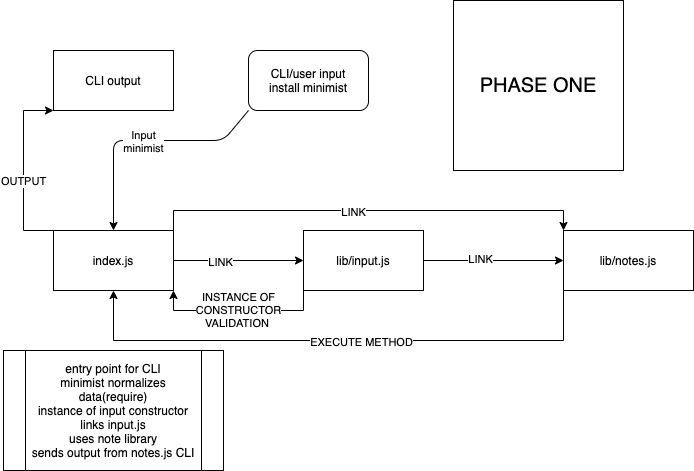

# LAB - Class 01

Project: Notesy

Author: Ben Hill

Links and Resources

submission PR: https://github.com/benhill-401-advanced-javascript/notes/pull/1

ci/cd (GitHub Actions)
https://github.com/benhill-401-advanced-javascript/notes/blob/master/.github/workflows/javascript-tests.yml

back-end server url (when applicable)

front-end application (when applicable)

Setup
.env requirements (where applicable)
i.e.

PORT - Port Number

MONGODB_URI - URL to the running mongo instance/db

How to initialize/run your application (where applicable)

- node --add "enter text in a string"

How to use your library (where applicable)

Tests

How do you run tests? (no tests for phase one)

Any tests of note? (not storing notes for phase one)

Describe any tests that you did not complete, skipped, etc
: none

UML

Link to an image of the UML for your application and response to events

